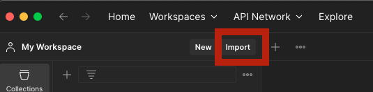
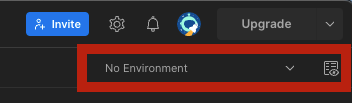

## Introduction
### Secure API Gateway v1.0 - Open Banking UK TPP Flows
Welcome to the Postman Collection for the Secure API Gateway, Open Banking Edition.
This collection can be used to try out the Secure API Gateway, v1.0 Open Banking APIs. 
Requests made by this postman collection will be made against a UK Open Banking Test Facility created using the Secure API Gateway, 
hosted by ForgeRock.

A UK Open Banking Test Facility is an implementation of the UK Open Banking specifications, 
backed by a `Test Facility` Bank that returns representative error codes and API responses. 
A test Facility allows developers to build applications against a bank's APIs without having to use the live bank APIs. 
In other words it is a developer sandbox that allows FinTechs to develop applications against a safe representation of a bank's offered APIs. 
In the UK every financial institution that offers open banking APIs must also offer a Test Facility.

The `Secure API Gateway` can also be used to build production Open Banking system, and to develop and deploy custom APIs secured 
to the same highly secure FAPI standards as Open Banking APIs.

The `Secure API Gateway` is an Open Source project initiated by ForgeRock. 
It uses ForgeRock's Identity Gateway and Identity Cloud to provide FAPI level API identity and access management for your APIs. 
It is intended to be used by ForgeRock customers wishing to develop highly secure APIs that are protected by;

## Documentation
For more information about this postman collection please see the published collection on the below link:
- https://postman.ob-sandbox-v1.forgerock.financial/#intro

## How to
### Pre requisites
- Install Postman app: https://www.postman.com/downloads/

### Import the collection
To use the `Secure API Gateway` postman collection for test purposes you need import the below files to postman app:
- Json collection descriptor file: `<folder version>`/`*.postman_collection.json`
- Json environment descriptor file: `<folder version>`/`*.postman_environment.json`

See the below table of versions to import, into postman application, the proper collection and environment files,
depending on the SAPI-G platform version to be tested.

**Table Versions**

| SAPI-G platform release | FQDN environment | SAPI-G postman collection                                                     | SAPI-G postman environment                        |
|-------------------------|------------------|-------------------------------------------------------------------------------|---------------------------------------------------|
| `v1.0`                  | ob-sandbox-v1    | `Secure API Gateway v1.0 - Open Banking UK TPP Flows.postman_collection.json` | `v1.0.0 release cluster.postman_environment.json` |

#### How to import
- _Option 1_: Drop the files anywhere in the postman application to import the collection and environment files
- _Option 2_: Use the `import` button at the left top bar to import the collection and environment files
- 
- Select the collection from the collection left bar
- Select the imported environment to be used by the collection
- 
- Read the documentation https://postman.ob-sandbox-v1.forgerock.financial/#intro

> Postman now is ready!